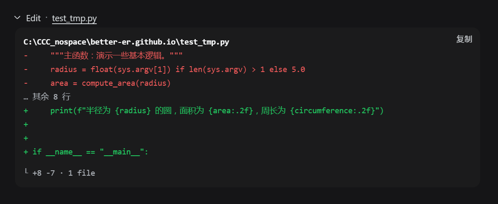

# dsh·工具结果自动展开插件

自动展开 DSH 浏览器界面里随后新到达的工具调用卡片，并在侧栏底部提供双向开关：打开时展开工具卡片，关闭时折叠已展开的工具卡片，默认开启。

纯浏览器端 client 插件，不替换任何原生工具卡片渲染器。


## 引言

DeepSeek Harness 的工具调用，默认和 CloseAI 一样是**收着**的——结果全都藏在折叠里不给你看。可这哪符合开源精神？**Open**！所有的工具调用结果，就该统统打开。

于是祥云做了这个插件，专门帮你把 DeepSeek Harness 自动**开源**掉——新到达的工具调用结果全部自动展开。不想看了？把开关一关，已经摊开的卡片立刻全部收回去，清爽如初。

当然，为了避免无意义的刷屏，这个「打开」是**短打开模式**：只执行一级展开，而不会把那些修改行统统二级展开。既能看到结论，又不糊一脸改动细节。

这样，你就能**爽爽监工 DeepSeek Harness**——它每一步在背后做了什么，都摊开在你眼皮子底下，清清楚楚。

却没想到，这狡猾的**蓝色大肥鱼**，就在你眼皮子底下偷偷啃着你的 Token——拿着你的钱上网玩儿去了。


## 功能

- 侧栏底部开关卡，**双向控制**工具卡片的展开与折叠：
  - 开关**打开**时，自动展开新渲染的工具调用卡片，并立刻展开页面上已存在的工具卡片。
  - 开关**关闭**时，立刻折叠页面上所有已展开的工具卡片，并让新到达的卡片保持默认收着。
- 只展开或折叠卡片**顶层**折叠行，**不会**误开内部 ReadBlock / TerminalBlock / DiffBlock / SearchBlock 的行数折叠。
- 开关卡随 DSH 明/暗主题自适应，切换即生效，无需重启。

## 效果

新到达的工具调用卡片自动展开后的实际效果：



## 演示视频

光看静态截图不过瘾？两位同好分别给这个插件拍了演示视频，还在标题上互相点名对方，欢迎点开对比观看：

| 祥云版 · 34 秒 | dpsk 版 · 23 秒 |
| :---: | :---: |
| [](https://www.bilibili.com/video/BV1S4b16pEnB/) | [](https://www.bilibili.com/video/BV1Mhb16DEYH/) |

## 安装

```powershell
dsh plugin --profile web add github:better-er/dsh-tool-autoexpand
```

或安装 npm 发布的版本：`dsh plugin --profile web add dsh-tool-autoexpand`。

一条命令装完即生效，自动挂载，重启 DSH web 后启用，无需手工编辑任何组合文件。

## 卸载

```powershell
dsh plugin --profile web remove dsh-tool-autoexpand
```

彻底移除，重启 DSH web 后不再加载。

## 要求与开发

- 是**标准形态的 dsh client 插件**，声明 `dsh.client`，导出 `./client`。
- 同时声明了 `dsh.bundle`，因此也是一个**自挂载的 bundle 层插件**：用 `dsh plugin --profile <name> add` 从 GitHub 安装后，会被自动识别为 profile layer 并挂载，无需手工写组合 entry。
- 纯浏览器半身，无 host 行为。
- 无构建：`lib/client.js` 是按 DSH client bundle 产出的注册式模块，源码即产物。

## License

[MIT](./LICENSE)
