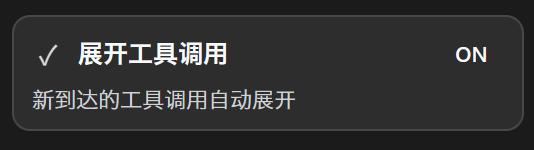

# dsh-tool-autoexpand

自动展开 DSH 浏览器界面里随后新到达的工具调用卡片，并在侧栏底部提供一个一目了然的自定义开关（默认开）。

纯浏览器端（client）插件，不替换任何原生工具卡片渲染器。



## 为什么值得

每一次工具调用都是你与模型协作的关键时刻，本该一眼看清、立刻跟上。可层层收起的结果，让专注总被打断，让你在「找、点、等」之间反复横跳。

**dsh-tool-autoexpand** 想让「看懂结果」这件事回归本能——新到达的结果自动展开，你的视线始终停留在结论上，而不是停留在展开按钮上。

它不改变你的工作流，只替你把最琐碎、最机械的那一步去掉。少一次点击，多一分专注；一打开 DSH，它就安静地帮你省下成百上千次展开。

如果效率是有对手的，那它最大的对手就是这种随处可见、却总是被忽略的「小麻烦」。**这个插件，就是冲着这些小麻烦去的。**

## 功能

- 自动展开新渲染的工具调用卡片。
- 只展开卡片**顶层**折叠行，**不会**误开内部 ReadBlock / TerminalBlock / DiffBlock / SearchBlock 的行数折叠。
- 侧栏底部开关卡：图标 + 标题 + ON/OFF 状态胶囊 + 一句效果说明，随 DSH 明/暗主题自适应。
- 整卡可点击，`aria-pressed` 同步状态；切换即启用/停用，无需重启。

```
┌──────────────────────────────────────┐
│ ▶  展开工具调用            ON        │
│     新到达的工具调用自动展开          │
└──────────────────────────────────────┘
```

## 要求

- 是**标准形态的 dsh client 插件**，依赖部署方拉起 loader entry（见下方「安装」）。
- 纯浏览器半身，无 host（node）服务。
- 目前无公开 npm 包，需要以本地/仓库方式挂载；正式安装方式见「安装」。

## 安装

本插件通过部署的 Cordis 组合挂载，而非 `npm i` 直接使用。

1. 将 `package.json`、`lib/` 复制到部署的共享 node_modules 下的 `dsh-tool-autoexpand/` 目录
   （等价于注入一个可被 loader 解析的包）。
2. 在部署的 web 组合文件中追加 loader entry：

   ```yaml
   - insert:
       - id: dsh-tool-autoexpand
         name: dsh-tool-autoexpand
   ```

3. 重启 DSH web 进程。

> 在你自己的机器上，`$DSH_HOME` 指 DSH 部署根（如 `~/.dsh`）。实际路径以你部署为准。

## 卸载

- 删除上一步的组合 entry；
- 删除复制进去的 `dsh-tool-autoexpand/` 目录；
- 重启 DSH web。

## 构建 / 打包

无构建步骤。`lib/client.js` 是已经按 DSH client bundle 产出的注册式模块
（`window.__ModuleLoader__.load({ id, factory })`），是源码也是产物。

`package.json` 关键字段：

- `dsh.client.platform: "web"` — 纯浏览器半身。
- `exports["./client"]` → `./lib/client.js` — 浏览器入口。

## 工作原理

- 监听会话容器，捕获新渲染的 `[data-chat-flow-kind="tool-call"]` 节点。
- 折叠展开策略：只点击**非 `<button>`** 的 `[aria-expanded="false"]` 元素
  （即一级 DisclosureRow / bash 卡片折叠行），**跳过一切 `<button>`**，从而不误开内部行数折叠。
- 侧栏开关通过 `sidebar.footer.action` 插槽注入。

## 硬性约束（维护者请看）

- `lib/client.js` 的 `factory` 必须以 `return module.exports` 结尾。
  否则 loader 的 `materialize()` 取到的模块导出为 `undefined`，Cordis 挂载时抛
  `invalid plugin, expect function or object with an "apply" method, received undefined`，
  DSH 启动即 fail-loud。对照 DSH 自带 client bundle 的 factory 末尾正是 `return module.exports;`。

## License

[MIT](./LICENSE)
